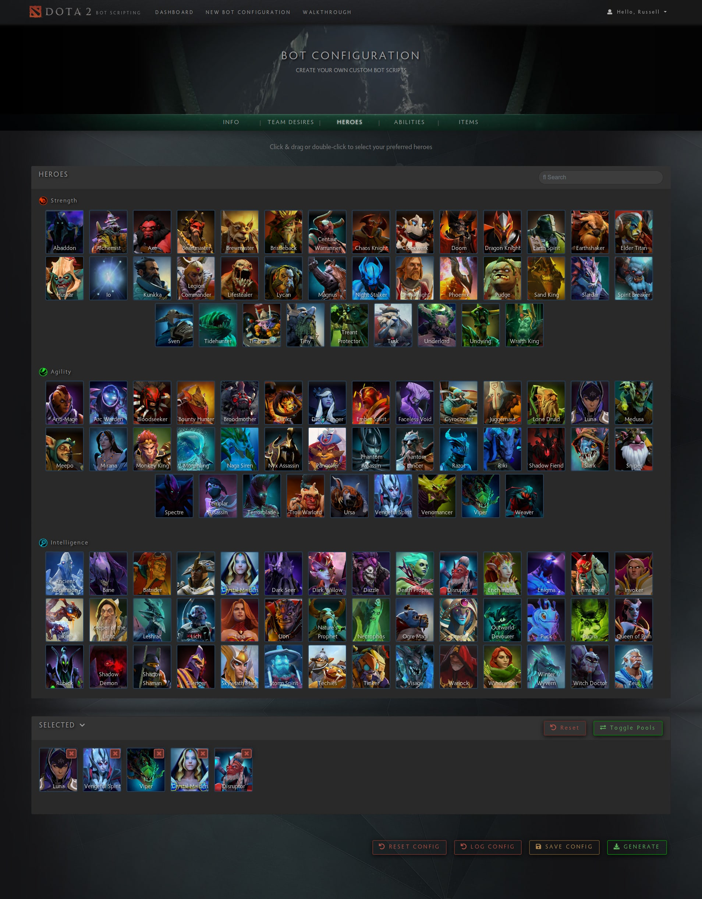
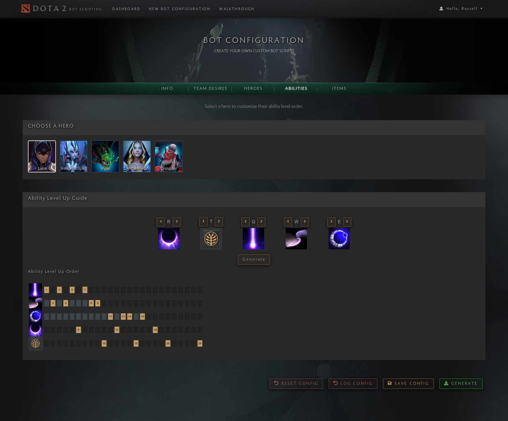
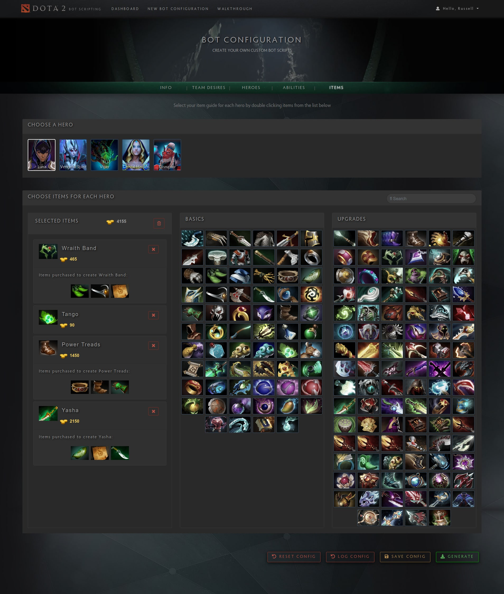

# Dota 2 Bot Configurator

The Dota 2 Bot Configurator is a tool that allows a Dota 2 player to specify a set of configuration options by means of a Web-based, Graphical User Interface from which a set of Lua scripts are generated. These scripts can be used by the game to alter the default bot behaviour in-game.

#### Features

- Exactly zero coding knowledge required. Write a bot script in minutes!
- Familiar interface for Dota 2 players.
- Save and edit multiple sets of bot scripts.

## Running Locally

#### Requirements

- Git
- Node.js (version 8 or 10)

Clone this repository with `git clone git@github.com:301-Redirection/301-Project.git`. 

Make sure to run `npm install && npm run scrape` to install project dependencies and fetch the images for the heroes and items. 

Run `npm start` to start. This will start the node server, running on http://localhost:3000 and the live server at http://localhost:4200. The GUI will automatically reload if you change any of the source files.

## Documentation

<ul>
    <li>
        <a href="https://github.com/301-Redirection/301-Project/raw/dev/documentation/Requirements%20and%20design.pdf" target="_blank">Functional & Architecture Document</a>
    </li>
    <li>
        <a href="https://github.com/301-Redirection/301-Project/raw/dev/documentation/Testing%20Policy%20Document.pdf" target="_blank">Testing Policy</a>
    </li>
    <li>
        <a href="https://github.com/301-Redirection/301-Project/raw/dev/documentation/Coding%20Standards.pdf" target="_blank">Coding Standards</a>
    </li>
    <li>
        <a href="https://github.com/301-Redirection/301-Project/raw/dev/documentation/UserManual.pdf" target="_blank">User Manual</a>
    </li>
    <li>
        <a href="https://github.com/301-Redirection/301-Project/blob/master/backend/lua/LuaScriptingDocumentation.md" target="_blank">Lua Scripting Format</a>
    </li>
</ul>

#### Diagrams

<ul>
    <li>
        <a href="https://github.com/301-Redirection/301-Project/raw/dev/documentation/Architectural%20Diagram.pdf" target="_blank">Architectural Diagram</a>
    </li>
    <li>
        <a href="https://github.com/301-Redirection/301-Project/raw/dev/documentation/Dota%202%20Demo%20Deployment%20Diagram.pdf" target="_blank">Deployment Diagram</a>
    </li>
    <li>
        <a href="https://github.com/301-Redirection/301-Project/raw/dev/documentation/Domain%20Model.pdf" target="_blank">Domain Model</a>
    </li>
    <li>
        <a href="https://github.com/301-Redirection/301-Project/raw/dev/documentation/Package%20diagram.pdf" target="_blank">Package Diagram</a>
    </li>
</ul>

## Build

Run `ng build` to build the project. The build artifacts will be stored in the `dist/` directory. Use the `-prod` flag for a production build.

## Running unit tests

Run `npm run test-frontend` to execute the unit tests via [Karma](https://karma-runner.github.io), `npm run test-backend` to execute the tests for the node server and `npm run test-all` to run both sets of tests. These commands also run the linters for our project.

## Screenshots

Choose Your Heroes!

Customize Abilities!

Specify Item Builds!

